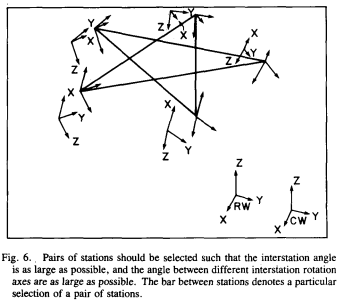
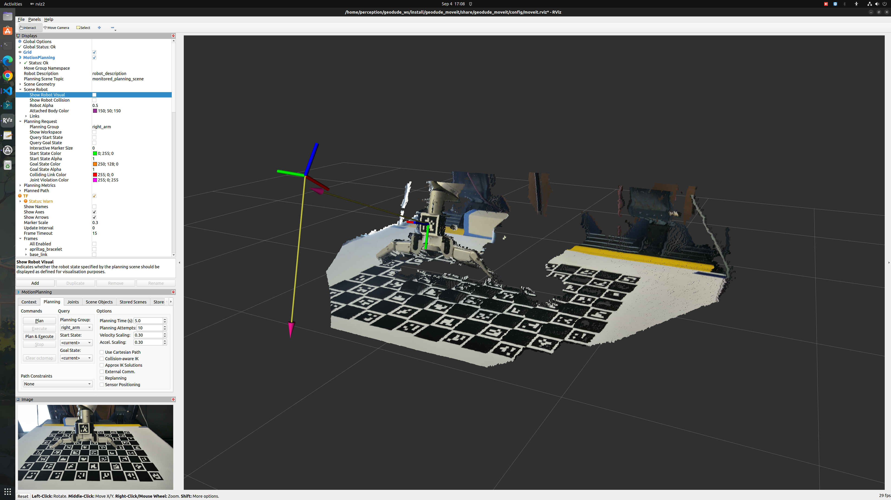

# Troubleshooting
### Apriltag markers

- The **marker should be solidly fixed** to a surface or to the robot hand, so that it does not move accidentally throughout the calibration procedure
AR marker tracking accuracy can degrade:
- Ensure the **marker size is correct**. It can happen that the printer automatically scales your PDF to fit it into the page, so ALWAYS measure the marker size after printing it (it feels stupid, but losing hours because of it feels much worse).
- If the camera is **not intrinsically calibrated**. You can use the relative camera_calibration ROS package for this purpose.
- Make sure you put the **coordinate frame in the right order**. There is an example below of what it should look like.

### Calibration frames

- The **robot frames** should be present in tf (robot_base -> effector).
- The **tracking** system should also publish the transform between the tracking base to marker (tracking_base -> marker). 

### Sampling 
- The advise given here is from [Tsai Lenz](https://www.semanticscholar.org/paper/A-new-technique-for-fully-autonomous-and-efficient-Tsai-Lenz/4790cf777e9bfd4444668de83c024567c9c3199a).
- In the paper it section IV shows how to create samples where we make a circle around the axis from the camera, then move the robot end effector in a **star** pattern while having the apriltag facing the camera (you can repeat this motion as many times to collect more samples). Here is the following diagram:  

- The **number of samples** must be sufficient, we recommend at least 15 samples (3 of each) as this is where the algorithm starts to converge (in terms of the transformation and reprojection error).
- The robot end effector must have moved into **all its degrees of freedom** (about all axes).
- When acquiring the samples, check that the **tracking is stable**, i.e. this means the **tf frames have stopped moving** (some component of your system might have a delay, so you need to wait a bit even after the robot has stopped moving). 
- When acquiring the samples, check that the **marker is within the field of view and near-centered** of the camera (the tf frame might "stop moving" at the edge of the field of view and remain stuck there, because of tf buffering), you can verify this by publishing the tracker's transform and visualizing it in rviz (see below). Additionally, our camera's ideal range was at least 0.3m away from the camera (not sure what the upper limit is, but we kept it within 0.35m).

### Visualizing in rviz

- Set the **fixed frame** to the tracking base frame (e.g. camera_link), this will allow you to visualize the pointcloud and the camera_link tf.
- Turn on the pointcloud of the camera and the tf frames of the camera and the marker. The marker should have a tf frame of tag36h11_0 (or similar) and should be visible in the camera's pointcloud.
- An example is shown below:  

- The tracking should be **accurate**; this can be verified by moving the robot with its control panel by a known quantity, and compare this movement to how the tracking system output changes (e.g. by moving the robot 5 cm in one direction, the marker coordinates should change accordingly). Of course, before calibration it is only possible to check the magnitude of the motion, but this can already identify problems with e.g. the AR marker size.
- Some apriltags are symmetric, so if the camera is **directly in front of the marker**, then the pose estimation may be ambiguous and the output may become unstable, constantly changing between two possible solutions due to symmetry. In this case, move the camera so that the marker does not appear like a square, but rather as asymmetric as possible.

